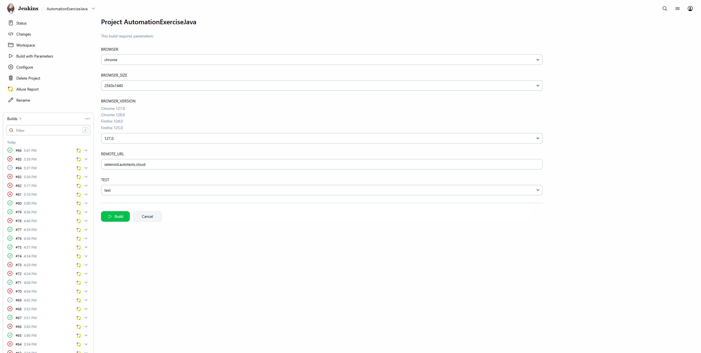

<h1 >Проект автоматизации тестирования для учебного проекта <a href="https://automationexercise.com">AutomationExercise</a></h1>

## Содержание

* <a href="#annotation">Описание</a>
* <a href="#tools">Технологии и инструменты</a>
* <a href="#cases">Реализованные проверки</a>
* <a href="#console">Запуск тестов из терминала</a>
* <a href="#jenkins">Запуск тестов в Jenkins</a>
* <a href="#allure">Отчеты в Allure</a>
* <a href="#testops">Интеграция с Allure TestOps</a>
* <a href="#testops">Интеграция с Jira</a>
* <a href="#telegram">Уведомления в Telegram с использованием бота</a>
* <a href="#video">Пример прогона теста в Selenoid</a>

<a id="annotation"></a>
## Описание
Тестовый проект состоит из веб-тестов (UI), тестов API.\
Содержание проекта:
- [x] `Page Object` проектирование
- [x] Возможность локального и удалённого запуска тестов
- [x] Возможность запуска как всех тестов, так и отдельно WEB, API
- [x] Использование `Faker` для генерации данных
- [x] Использование `Lombok` для моделей в API тестах
- [x] Использование request/response спецификаций для API тестов
- [x] Custom Allure listener для API requests/responses логов
- [x] Интеграция с `Allure TestOps`
- [x] Возможность запуска тестов напрямую из `Allure TestOps`
- [x] Интеграция с `Jira`
- [x] Автотесты оформлены как тестовая документация посредством аннотаций `Allure`


<a id="tools"></a>
## Технологии и инструменты

<div align="center">
<a href="https://www.jetbrains.com/idea/"></a>
<a href="https://github.com/"></a>  
<a href="https://www.java.com/"></a>
<a href="https://gradle.org/"></a>  
<a href="https://junit.org/junit5/"></a>
<a href="https://selenide.org/"></a>
<a href="https://aerokube.com/selenoid/"></a>
<a href="https://rest-assured.io/"></a>
<a href="https://www.browserstack.com/"></a>
<a href="https://appium.io/"></a>
<a href="https://developer.android.com/studio"></a>
<a href="https://www.jenkins.io/"></a>
<a href="https://github.com/allure-framework/"></a>
<a href="https://qameta.io/"></a>
<a href="https://www.atlassian.com/software/jira"></a>  
<a href="https://telegram.org/"></a>
</div>


Автотесты в этом проекте написаны на Java с использованием фреймворка [Selenide](https://selenide.org/).\
<code>Gradle</code> — используется как инструмент автоматизации сборки.\
<code>JUnit5</code> — для выполнения тестов.\
<code>Selenoid</code> — для удаленного запуска браузера в Docker контейнерах.\
<code>REST Assured</code> — для тестирования REST-API сервисов.\
<code>Jenkins</code> — CI/CD для запуска тестов удаленно.\
<code>Browserstack</code> — для запуска мобильных тестов удаленно.\
<code>Appium</code>, <code>Android Studio</code> — для запуска мобильных тестов локально на эмуляторе мобильных устройств.\
<code>Allure Report</code> — для визуализации результатов тестирования.\
<code>Allure TestOps</code> — как система управления тестированием.\
<code>Jira</code> — как инструмент управления проектом и таск-трекер.\
<code>Telegram Bot</code> — для уведомлений о результатах тестирования.

## Allure-отчет

Allure-отчет включает в себя:

- **Статус тестов**: пройдено, провалено, пропущено.  
- **Интерактивную инфографику**: графики по выполнению тестов, распределение по suite, по тегам, процент прохождения.  
- **Детализированные шаги выполнения тестов**: последовательность действий и проверок.  
- **Вспомогательные артефакты**:
  - Скриншоты страниц в момент завершения автотеста  
  - Page Source  
  - Логи браузерной консоли  
  - Видео выполнения автотеста 

<a id="cases"></a>
## Реализованные проверки
### Автоматизированные проверки WEB

:heavy_check_mark: Проверка регистрации нового пользователя

:heavy_check_mark: Проверка авторизации с корректными email и паролем

:heavy_check_mark: Проверка авторизации с некорректными email и паролем

:heavy_check_mark: Проверка выхода пользователя из системы (Logout)

:heavy_check_mark: Проверка регистрации пользователя с уже существующим email

:heavy_check_mark: Проверка формы обратной связи Contact Us

:heavy_check_mark: Проверка страницы Test Cases

:heavy_check_mark: Проверка страницы All Products и карточки продукта

:heavy_check_mark: Проверка поиска продукта

:heavy_check_mark: Проверка подписки (Subscription) на главной странице

<a id="console"></a>
##  Запуск тестов из терминала
### Локальный запуск тестов
#### WEB

```
gradle clean ui_test 
```

#### API

```
gradle clean api_test 
```

### Удаленный запуск тестов

```
clean test 
  -Dbrowser=${BROWSER} 
  -DbrowserVersion=${BROWSER_VERSION} 
  -DbrowserSize=${BROWSER_SIZE} 
  -DremoteUrl=${REMOTE_URL}
  -DenvMobile=${ENV_MOBILE}
```

> `${BROWSER}` - наименование браузера (_по умолчанию - <code>chrome</code>_).
> 
> `${BROWSER_VERSION}` - номер версии браузера (_по умолчанию - <code>128.0</code>_).
> 
> `${BROWSER_SIZE}` - размер окна браузера (_по умолчанию - <code>1980x1080</code>_).
>
> `${REMOTE_URL}` - адрес удаленного сервера, на котором будут запускаться тесты.

<a id="jenkins"></a>
## Запуск тестов в <a target="_blank" href="https://jenkins.autotests.cloud/job/AutomationExerciseJava/"> Jenkins </a>

> Сборка с параметрами позволяет перед запуском изменить параметры для сборки (путем выбора из списка или прямым указанием значения).

<p align="center">

</p>

<a id="allure"></a>
## Отчеты в <a target="_blank" href="https://jenkins.autotests.cloud/job/017-Jenny_Ndbn-java-24-webinar-final-project/8/allure/"> Allure report </a> 

### Основное окно

<p align="center">

</p>

### Тесты

<p align="center">

</p>

### Графики

<p align="center">

</p>

<a id="telegram"></a>
## Уведомления в Telegram с использованием бота

<p>

</p>

<a id="video"></a>
## Пример прогона теста в Selenoid

> К каждому web-тесту в отчете прилагается видео
<p align="center">
  
</p>
